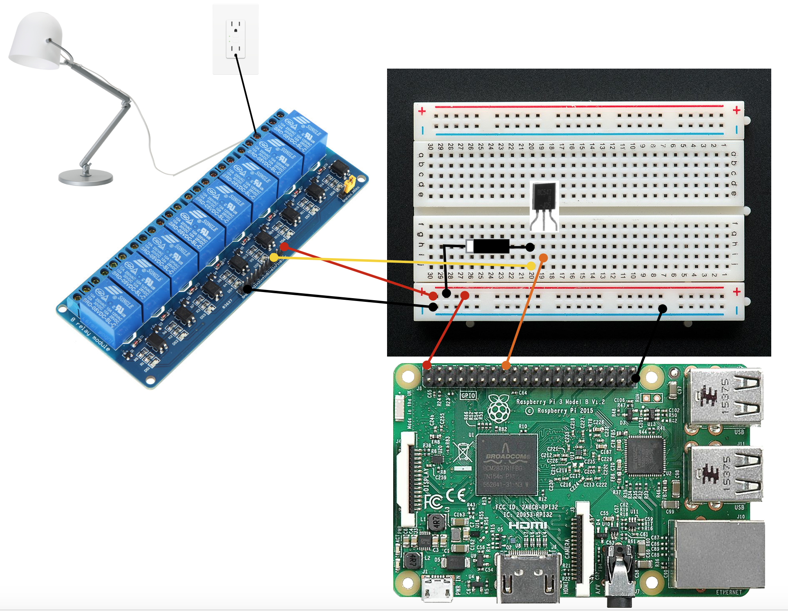
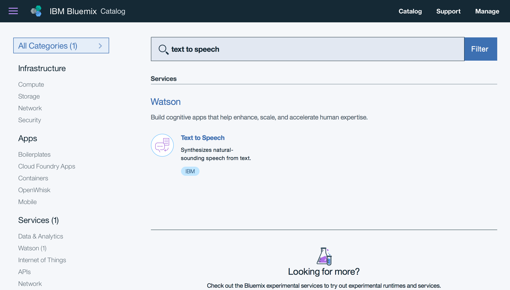
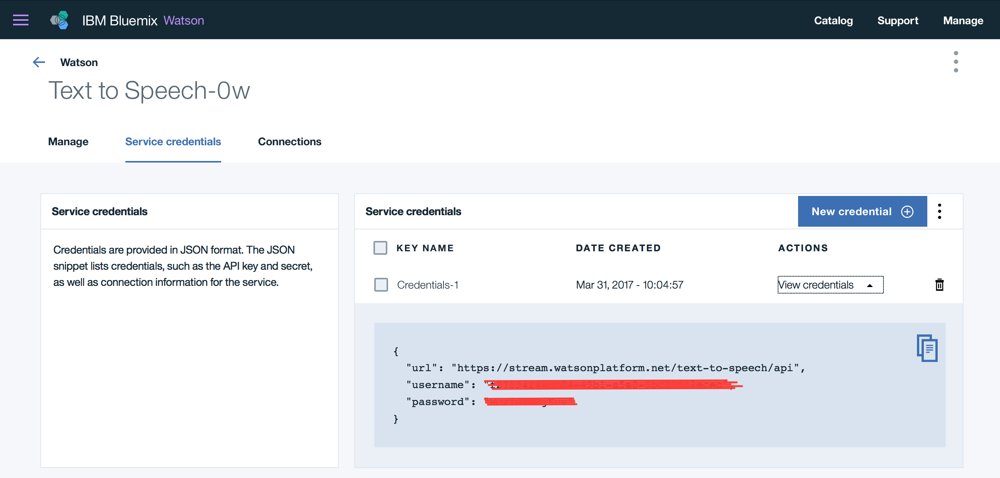

# Thien An Bot Lightup

This recipe guides you through how to connect your Raspberry Pi to IBM Watson services and make a simple robot which can listen to your commands and `turn on`, `turn off` a lamp.

Click [here](https://youtu.be/w4lEJGe1pNU) or on the picture below to see the demo:

[](https://youtu.be/w4lEJGe1pNU)

## Hardware requirements

- A Raspberry Pi B. I use Raspberry 3 for this tutorial, which has built-in wifi. If you have other models, need to make sure you have Wifi dongle or other ways to get your Pi connected to the internet (eg: sharing through ethernet, etc)
- Male-female and male-male jumpers, Breadboard
- BC547 transistor.
- Songle SRD-05VDC-SL-C relay and 1n4001 diode.
- 220Ohm resistor.
- Speaker. I use an Anker A7910 mini speaker
- Lamp and power strip

## Other requirements

- IBM Bluemix account, [free](https://bluemix.net)
- Refer to [this](https://www.youtube.com/watch?v=PPvIBH7M32Y) to know how to setup your Pi. Try to get the latest OS version.
- Git, Node.js, npm on your Raspberry: `sudo apt-get install nodejs npm node-semver`

## Steps to cook the recipe

### Wire up the parts

Here is the circuit diagram for the example



### Create Watson text to speech service

Follow [this](https://github.com/dnguyenv/distance-bot#create-bluemix-text-to-speech-service) instruction to create a text to speech service in Bluemix

### Create Watson speech to text service

Login to [Bluemix](https://bluemix.net) with your registered ID, Go to `Catalog`, Search for `speech to text` , or click [here](https://console.ng.bluemix.net/catalog/?taxonomyNavigation=iot&search=text%20to%20speech) and select the service.



Name the `service` and `credential` if you want, or just leave them by default, Select `Create`

Once the service is created, go to `Service credentials` , `View credentials` section to record the `username` and `password` information. You will need it later for the app. You can always create a new `credential` to access the service as needed, by selecting `New credential`



### Clone the code and install dependencies

Clone the source code:

Get into your Pi using SSH or VNC client. From the terminal in your Raspberry Pi, perform this command to get the source code:

`git clone https://github.com/dnguyenv/lightup.git`

Put your Watson services credentials (both Text to speech and Speech to text service) into the config.js file. You also can configure other values in the file to meet your need.

Run the code:

```
cd lightup
npm install
npm start
```
